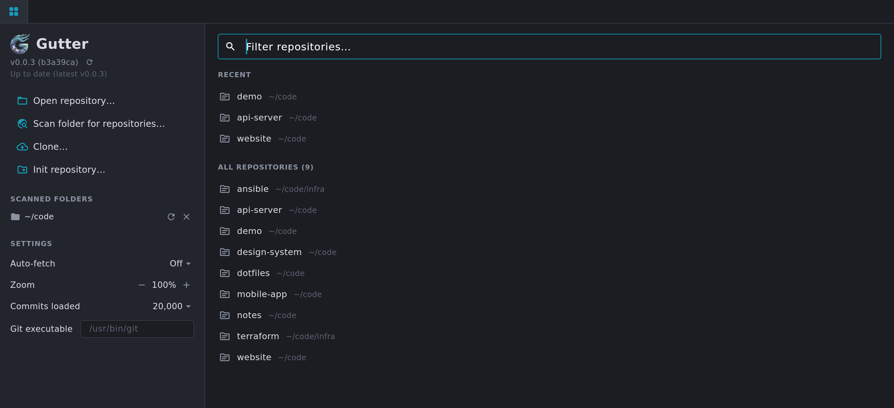
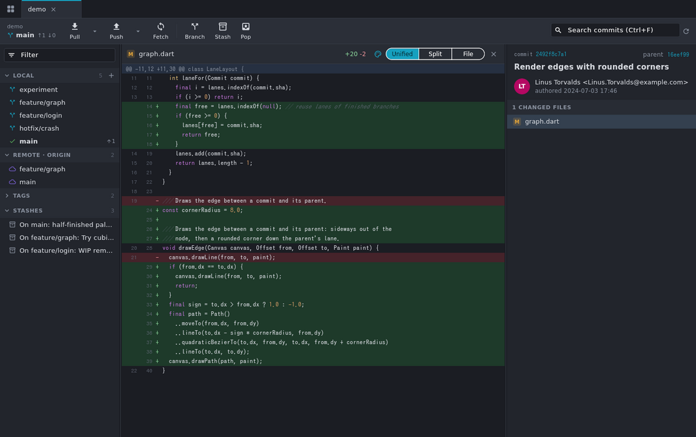

# Gutter

A fast, local-only git client for the desktop (macOS and Linux), inspired by
GitKraken. Built with Flutter, driving your system `git`. No accounts or
cloud features, and nothing leaves your machine except your own
fetch/push.

> **Disclaimer:** This app was heavily vibe coded with Claude Opus 5.5. Mostly out of spite of GitKraken becoming ever so bloated and unstable.


## Features

- **Commit graph**: lane-colored branches, ref labels (local and remote
  merged into one label, tags), author-initials nodes, a WIP row for
  uncommitted changes, stashes shown where they were made (dotted line to
  their base commit), search (`Ctrl/Cmd+F`) and keyboard navigation.
  It loads 20k commits by default and fetches more as you scroll (the
  batch size, or All, is set on the home tab).
- **Tabs**: one per repository, with the session restored on start.
  - Only the **active tab auto-fetches** (every 5 minutes by default, and
    never while the window is unfocused).
  - A background tab fetches when you switch to it, if its interval has
    passed.
- **Repository discovery**: pick a folder and every git repository under
  it (including nested ones) is found in the background. You can also
  open, clone or init repositories directly.

  

- **Staging**: stage, unstage or discard whole files, single hunks, or
  selected lines (click the line-number gutter; shift-click selects a
  range).

  

- **Diffs**: unified or split view, plus a full-file preview (images too),
  with optional syntax highlighting for about 40 languages.

  

- **Branches and history**: checkout by double-click (on a remote branch
  it checks out the local branch, creating it or fast-forwarding it to the
  remote as needed), create, rename and delete branches, tags, merge
  (ff / no-ff / ff-only / squash), rebase, cherry-pick, revert,
  reset (soft / mixed / hard), stash, pull (ff-only / merge / rebase),
  push (sets the upstream automatically; if the remote rejects it, Gutter
  offers a force push with lease).
  With uncommitted changes, a rebase, reset or rebasing pull first asks
  whether to stash or discard them, or cancel.
- **Multiple commits**: Shift-click selects a range in the graph and
  Ctrl/Cmd-click adds or removes commits. Selected commits can be
  cherry-picked together (oldest first), or squashed into one when
  they're consecutive commits of the current branch (this opens the
  interactive rebase dialog, preset, so you can edit the message).
- **Interactive rebase**: reorder, pick, reword, edit, squash, fixup
  and drop, all without a text editor.
  - Select several commits (checkboxes, Shift/Ctrl-click, `Ctrl/Cmd A`)
    and apply an action to all of them. Squashing a selection folds it
    into its oldest commit.
  - Keyboard: `P` `R` `E` `S` `F` `D` set the action, `↑ ↓` move
    (`Shift` extends the selection), `Alt ↑ ↓` reorder.

  

- **Conflicts**: a banner for merges, rebases, cherry-picks and reverts in
  progress, with continue / skip / abort. For each conflicted file you
  can take ours or theirs, mark it resolved, or open it in an external
  editor.
- **Errors and output**: failures get a short explanation (credentials,
  SSH keys, the network, local changes in the way…) and a **Details**
  button. It opens the tab's **Output** panel (collapsed at the bottom)
  on the failed command. The panel lists every git command the tab ran,
  with its output, duration and exit code. The automatic refreshes are
  hidden unless you ask for them.
- **UI zoom** for high-DPI screens: `Ctrl/Cmd +`, `Ctrl/Cmd -`,
  `Ctrl/Cmd 0`, or `Ctrl/Cmd` + mouse wheel (50–300%). The level is saved.

## Performance notes

- Output from git is NUL-separated and parsed off the UI thread. The graph
  is laid out in an isolate, stored in compact typed arrays, and only the
  visible rows are painted.
- Graph memory stays proportional to the number of commits, however wide
  the graph gets: 85k commits of git.git take about 1.5 MB, laid out in
  about 130 ms.
- If a large repository has no commit-graph file, Gutter writes one (git's
  own cache, normally created by `git gc`/`git maintenance`) and keeps it
  updated on fetch. This makes loading history several times faster.

## Shortcuts

| Keys | Action |
| --- | --- |
| `Ctrl/Cmd T` | Repositories (home) tab |
| `Ctrl/Cmd O` | Open repository |
| `Ctrl/Cmd W` | Close tab |
| `Ctrl Tab` / `Ctrl Shift Tab` | Next / previous tab |
| `Ctrl/Cmd 1…9` | Go to tab |
| `Ctrl/Cmd R`, `F5` | Refresh |
| `Ctrl/Cmd F` | Search commits (`Enter` / `Shift Enter` to step) |
| `↑ ↓ PgUp PgDn Home End` | Move through the graph |
| `Ctrl/Cmd Enter` | Commit (in the message box) |
| `Esc` | Close diff |
| `P R E S F D` | Interactive rebase: pick / reword / edit / squash / fixup / drop the selected commits |
| `Alt ↑ ↓` | Interactive rebase: move the selected commits |
| `Ctrl/Cmd + / - / 0` | Zoom in / out / reset |

## Install on macOS

Download `Gutter-macos-<version>.zip` from the
[Releases](https://github.com/serjlee/gutter/releases) page. The build is
universal (Apple Silicon and Intel).

Gutter is **ad-hoc signed and not notarized** (there's no paid Apple
Developer account behind it). So macOS blocks the downloaded app until you
clear its quarantine flag. Do it once per update, using any of these:

- **Script**: `tool/install_macos.sh` downloads the latest release
  (needs `gh`), installs it to `/Applications` and clears the flag.
  You can also pass a zip you downloaded: `tool/install_macos.sh
  ~/Downloads/Gutter-macos-0.1.0.zip`.
- **Terminal**: move `Gutter.app` to `/Applications`, then run
  `xattr -dr com.apple.quarantine /Applications/Gutter.app`.
- **System Settings**: open Gutter once (it gets blocked), then go to
  System Settings → Privacy & Security and click **Open Anyway**. On
  macOS 15 and later, right-click → Open no longer bypasses the block.

Other things to know:

- Gutter needs `git`. Install it with `xcode-select --install` or Homebrew.
- The first time you scan a folder under Documents or Desktop, macOS asks
  for access. Click Allow.
- **Releases**: `git tag -a v0.1.0 -m "What's new…" && git push origin
  v0.1.0` builds the macOS zip, a Linux tarball and a Flatpak bundle, and
  publishes them as a GitHub Release (`.github/workflows/release.yml`).
  The tag's message (from `-m`, or the editor with a bare `git tag -a
  v0.1.0`) opens the release notes, before the install instructions; a
  lightweight tag gets the instructions only. CI on `main` and pull requests runs on Linux only.
- **Signing later**: with a Developer ID certificate, the workflow could
  sign and notarize the app (hardened runtime + `xcrun notarytool`). The
  quarantine step would then go away.

## Install on Linux

From the [Releases](https://github.com/serjlee/gutter/releases) page,
either:

- **Flatpak**: `flatpak install --user gutter-linux-x64-<version>.flatpak`
  (it fetches the Freedesktop runtime from Flathub), then open Gutter from
  your app menu or run `flatpak run dev.gutter.gutter`. It runs your
  system's git through `flatpak-spawn --host`, so your config, credential
  helpers, signing keys and hooks work as in a terminal. It can read files
  anywhere (`--filesystem=host`).
- **Tarball**: extract `gutter-linux-x64-<version>.tar.gz` and run
  `./gutter`. Needs GTK 3.

Both need `git` installed. To build the Flatpak locally, see
`linux/flatpak/dev.gutter.gutter.yml`.

## Building

You need Flutter (stable) and git.

```sh
flutter pub get
flutter run -d macos        # or: -d linux
flutter build macos --release
```

- **Version label**: the home tab shows the build's version, which is
  embedded at build time. Tagged CI releases set both values (and the
  bundle version shown in macOS's About panel), and fail if the build
  doesn't contain them (`tool/check_version.sh`). To label a local build,
  pass:
  `--dart-define=GUTTER_VERSION=0.1.0 --dart-define=GUTTER_COMMIT=$(git rev-parse --short HEAD)`.
- **Update checks**: every 6 hours Gutter asks GitHub for the latest
  release of `serjlee/gutter` and shows a link on the home tab when a
  newer one exists.
- **GitHub avatars**: for repositories on GitHub, commit authors show
  their GitHub profile pictures. Gutter asks GitHub's avatar server for
  each author's picture by commit email as rows come into view (no API
  calls, so no rate limits or tokens). Authors whose email isn't on a
  GitHub account keep their initials; that answer is remembered for a
  week in `avatars.json` next to the settings. It can be turned off on the
  home tab. Besides this and the update check, Gutter makes no network
  requests of its own.
- **Icons**: the app icons and the home tab logo are generated from
  `assets/icon/source.png` by `tool/make_icons.sh` (needs ImageMagick).
- **Linux** also needs `clang cmake ninja-build pkg-config libgtk-3-dev`.
- **macOS**: the app sandbox is disabled (see `macos/Runner/*.entitlements`)
  because Gutter runs `git` and reads repositories anywhere on disk.
- **git location**: Gutter looks for git on `PATH`, then in
  `/opt/homebrew/bin`, `/usr/local/bin` and `/usr/bin`. On macOS it tries
  Homebrew's first: apps opened from Finder don't get your shell's `PATH`,
  and `/usr/bin/git` only works once Apple's command line tools are
  installed. You can override it in the settings on the home tab. If a
  repository can't be opened, the error says why (git missing, a folder
  macOS protects, and so on).
- **Authentication**: fetch, pull and push use your existing git setup
  (SSH agent, credential helper). Gutter never shows a password prompt,
  so an operation that needs one fails with git's error message instead
  of hanging.

## Development

```sh
flutter analyze
flutter test                                      # includes tests against real temp repos
xvfb-run flutter drive --profile -d linux \
  --driver test_driver/integration_test.dart \
  --target integration_test/app_test.dart         # real app, AOT-compiled
dart run tool/bench_layout.dart 200000            # graph layout benchmark
dart run tool/bench_repo.dart /path/to/big/repo   # history load timings
tool/make_demo_repo.sh /tmp/demo                  # branchy demo repository
```

## Layout

```
lib/git/     git runner, parsers, Repository API, partial patches, rebase plans
lib/graph/   lane layout + row painter
lib/scan/    repository discovery
lib/app/     app state, settings, theme, zoom
lib/ui/      shell, tabs, graph view, sidebar, details, diff, dialogs
```

## License

Copyright (C) 2026 the Gutter contributors.

Gutter is free software: you can redistribute it and/or modify it under the
terms of the GNU General Public License as published by the Free Software
Foundation, either version 3 of the License, or (at your option) any later
version. It is distributed in the hope that it will be useful, but WITHOUT ANY
WARRANTY; without even the implied warranty of MERCHANTABILITY or FITNESS FOR A
PARTICULAR PURPOSE. See [LICENSE](LICENSE) for the full text.
