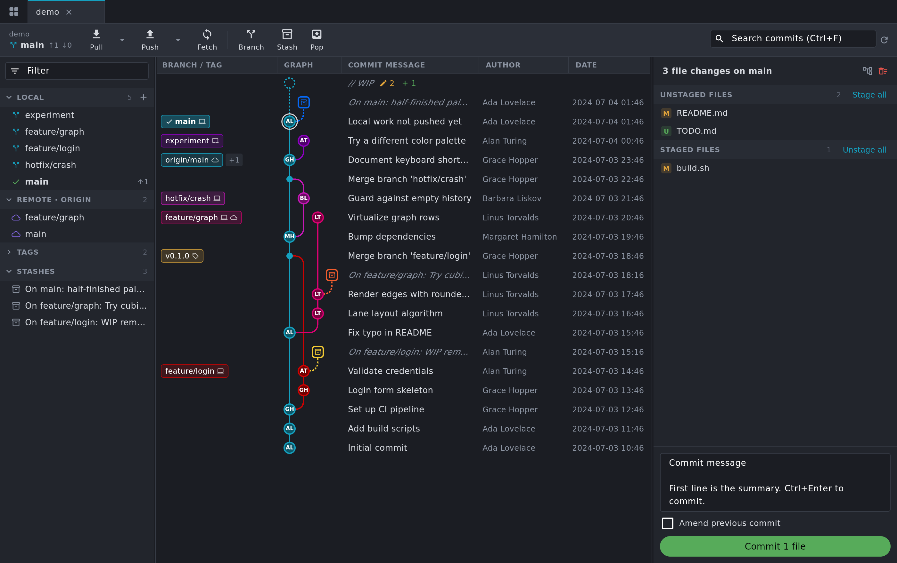
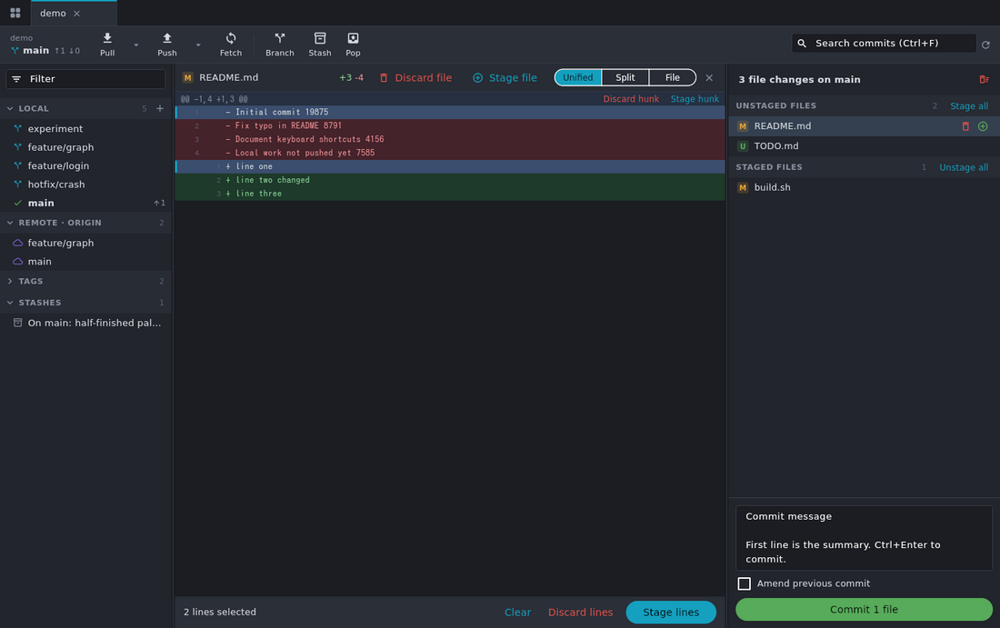
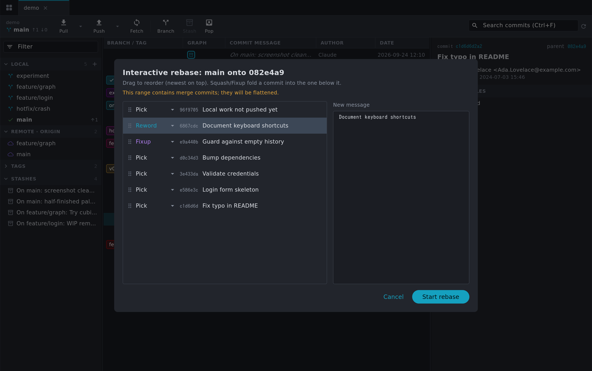
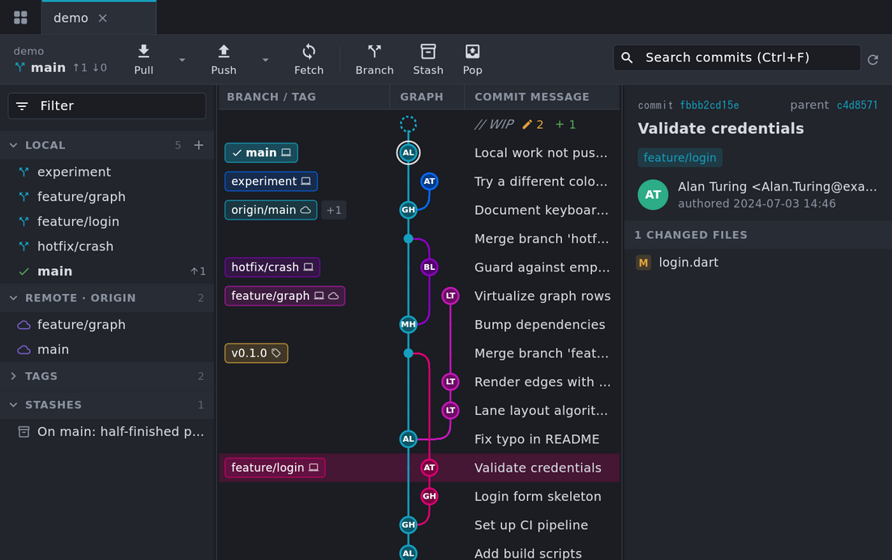

# Gutter

A fast, local-only git client for the desktop (macOS and Linux), inspired by
GitKraken. Built with Flutter, driving your system `git`. No accounts or
cloud features, and nothing leaves your machine except your own
fetch/push.

> **Disclaimer:** This app was heavily vibe coded with Claude Opus 5.5. Mostly out of spite of GitKraken becoming ever so bloated and unstable.



## Features

- **Commit graph**: lane-colored branches, ref labels (local and remote
  merged into one label, tags), author-initials nodes, a WIP row for
  uncommitted changes, search (`Ctrl/Cmd+F`) and keyboard navigation.
  It loads 20k commits by default and fetches more as you scroll.
- **Tabs**: one per repository, with the session restored on start.
  - Only the **active tab auto-fetches** (every 5 minutes by default, and
    never while the window is unfocused).
  - A background tab fetches when you switch to it, if its interval has
    passed.
- **Repository discovery**: pick a folder and every git repository under
  it (including nested ones) is found in the background. You can also
  open, clone or init repositories directly.
- **Staging**: stage, unstage or discard whole files, single hunks, or
  selected lines (click the line-number gutter; shift-click selects a
  range).

  

- **Diffs**: unified or split view, plus a full-file preview (images too).
- **Branches and history**: checkout (including remote branches as
  tracking branches), create, rename and delete branches, tags, merge
  (ff / no-ff / ff-only / squash), rebase, cherry-pick, revert,
  reset (soft / mixed / hard), stash, pull (ff-only / merge / rebase),
  push (sets the upstream automatically; force-with-lease is available).
- **Interactive rebase**: reorder, pick, reword, edit, squash, fixup
  and drop, all without a text editor.

  

- **Conflicts**: a banner for merges, rebases, cherry-picks and reverts in
  progress, with continue / skip / abort. For each conflicted file you
  can take ours or theirs, mark it resolved, or open it in an external
  editor.
- **UI zoom** for high-DPI screens: `Ctrl/Cmd +`, `Ctrl/Cmd -`,
  `Ctrl/Cmd 0`, or `Ctrl/Cmd` + mouse wheel (50–300%). The level is saved.

  

## Performance notes

- Output from git is NUL-separated and parsed off the UI thread. The graph
  is laid out in an isolate, stored in compact typed arrays, and only the
  visible rows are painted.
- Graph memory stays proportional to the number of commits, however wide
  the graph gets: 85k commits of git.git take about 1.5 MB, laid out in
  about 130 ms.
- If a large repository has no commit-graph file, Gutter writes one (git's
  own cache, normally created by `git gc`/`git maintenance`) and keeps it
  updated on fetch. This makes loading history several times faster.

## Shortcuts

| Keys | Action |
| --- | --- |
| `Ctrl/Cmd T` | Repositories (home) tab |
| `Ctrl/Cmd O` | Open repository |
| `Ctrl/Cmd W` | Close tab |
| `Ctrl Tab` / `Ctrl Shift Tab` | Next / previous tab |
| `Ctrl/Cmd 1…9` | Go to tab |
| `Ctrl/Cmd R`, `F5` | Refresh |
| `Ctrl/Cmd F` | Search commits (`Enter` / `Shift Enter` to step) |
| `↑ ↓ PgUp PgDn Home End` | Move through the graph |
| `Ctrl/Cmd Enter` | Commit (in the message box) |
| `Esc` | Close diff |
| `Ctrl/Cmd + / - / 0` | Zoom in / out / reset |

## Install on macOS

Download `Gutter-macos-<version>.zip` from the
[Releases](https://github.com/serjlee/gutter/releases) page. The build is
universal (Apple Silicon and Intel).

Gutter is **ad-hoc signed and not notarized** (there's no paid Apple
Developer account behind it). So macOS blocks the downloaded app until you
clear its quarantine flag. Do it once per update, using any of these:

- **Script**: `tool/install_macos.sh` downloads the latest release
  (needs `gh`), installs it to `/Applications` and clears the flag.
  You can also pass a zip you downloaded: `tool/install_macos.sh
  ~/Downloads/Gutter-macos-0.1.0.zip`.
- **Terminal**: move `Gutter.app` to `/Applications`, then run
  `xattr -dr com.apple.quarantine /Applications/Gutter.app`.
- **System Settings**: open Gutter once (it gets blocked), then go to
  System Settings → Privacy & Security and click **Open Anyway**. On
  macOS 15 and later, right-click → Open no longer bypasses the block.

Other things to know:

- Gutter needs `git`. Install it with `xcode-select --install` or Homebrew.
- The first time you scan a folder under Documents or Desktop, macOS asks
  for access. Click Allow.
- **Releases**: `git tag v0.1.0 && git push origin v0.1.0` builds the
  macOS zip and a Linux tarball and publishes them as a GitHub Release
  (`.github/workflows/release.yml`). CI on `main` and pull requests runs on
  Linux only.
- **Signing later**: with a Developer ID certificate, the workflow could
  sign and notarize the app (hardened runtime + `xcrun notarytool`). The
  quarantine step would then go away.

## Building

You need Flutter (stable) and git.

```sh
flutter pub get
flutter run -d macos        # or: -d linux
flutter build macos --release
```

- **Version label**: the home tab shows the build's version, which is
  embedded at build time. Tagged CI releases set both values (and the
  bundle version shown in macOS's About panel), and fail if the build
  doesn't contain them (`tool/check_version.sh`). To label a local build,
  pass:
  `--dart-define=GUTTER_VERSION=0.1.0 --dart-define=GUTTER_COMMIT=$(git rev-parse --short HEAD)`.
- **Update checks**: every 6 hours Gutter asks GitHub for the latest
  release of `serjlee/gutter` and shows a link on the home tab when a
  newer one exists. It's the app's only network request of its own.
- **Icons**: the app icons and the home tab logo are generated from
  `assets/icon/source.png` by `tool/make_icons.sh` (needs ImageMagick).
- **Linux** also needs `clang cmake ninja-build pkg-config libgtk-3-dev`.
- **macOS**: the app sandbox is disabled (see `macos/Runner/*.entitlements`)
  because Gutter runs `git` and reads repositories anywhere on disk.
- **git location**: Gutter looks for git on `PATH`, then in
  `/opt/homebrew/bin`, `/usr/local/bin` and `/usr/bin`. You can override
  it in the settings on the home tab.
- **Authentication**: fetch, pull and push use your existing git setup
  (SSH agent, credential helper). Gutter never shows a password prompt,
  so an operation that needs one fails with git's error message instead
  of hanging.

## Development

```sh
flutter analyze
flutter test                                      # includes tests against real temp repos
xvfb-run flutter drive --profile -d linux \
  --driver test_driver/integration_test.dart \
  --target integration_test/app_test.dart         # real app, AOT-compiled
dart run tool/bench_layout.dart 200000            # graph layout benchmark
dart run tool/bench_repo.dart /path/to/big/repo   # history load timings
tool/make_demo_repo.sh /tmp/demo                  # branchy demo repository
```

## Layout

```
lib/git/     git runner, parsers, Repository API, partial patches, rebase plans
lib/graph/   lane layout + row painter
lib/scan/    repository discovery
lib/app/     app state, settings, theme, zoom
lib/ui/      shell, tabs, graph view, sidebar, details, diff, dialogs
```

## License

Copyright (C) 2026 the Gutter contributors.

Gutter is free software: you can redistribute it and/or modify it under the
terms of the GNU General Public License as published by the Free Software
Foundation, either version 3 of the License, or (at your option) any later
version. It is distributed in the hope that it will be useful, but WITHOUT ANY
WARRANTY; without even the implied warranty of MERCHANTABILITY or FITNESS FOR A
PARTICULAR PURPOSE. See [LICENSE](LICENSE) for the full text.
