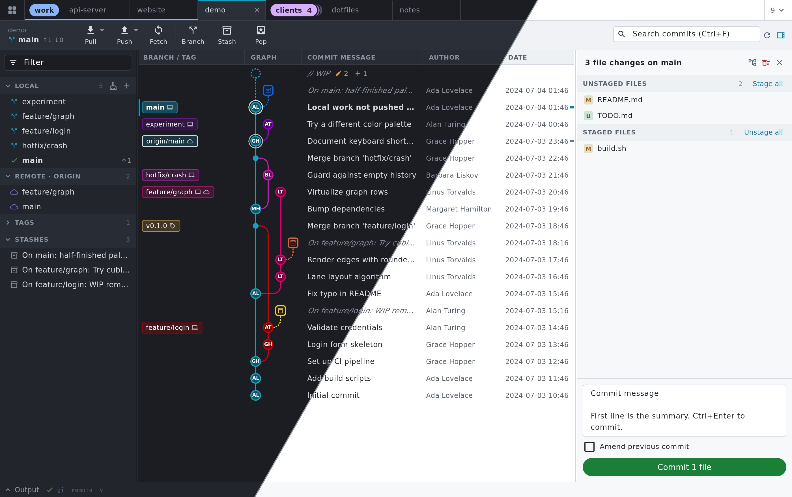
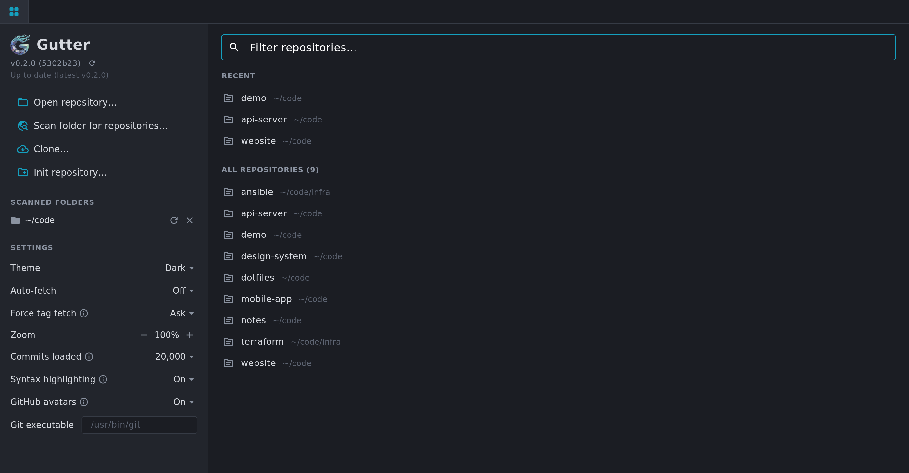
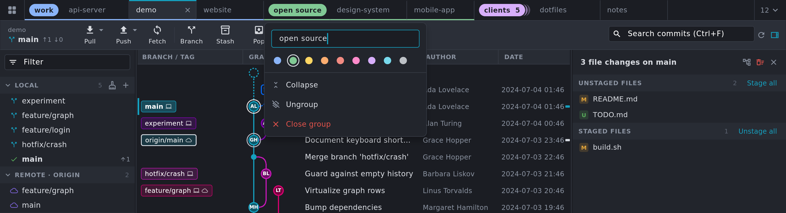
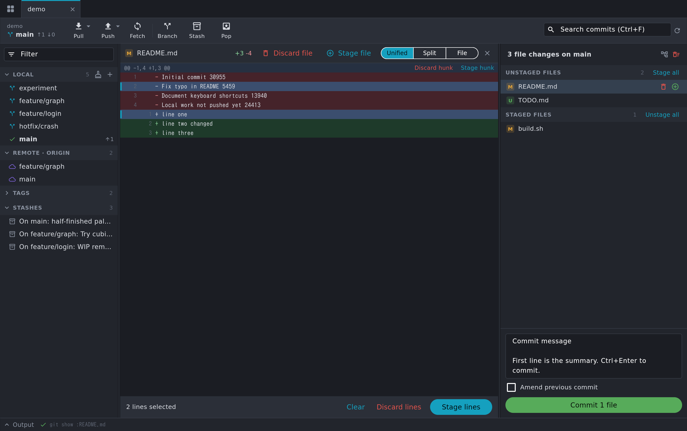
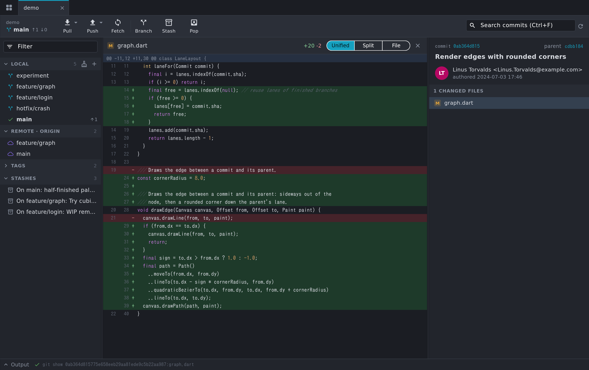
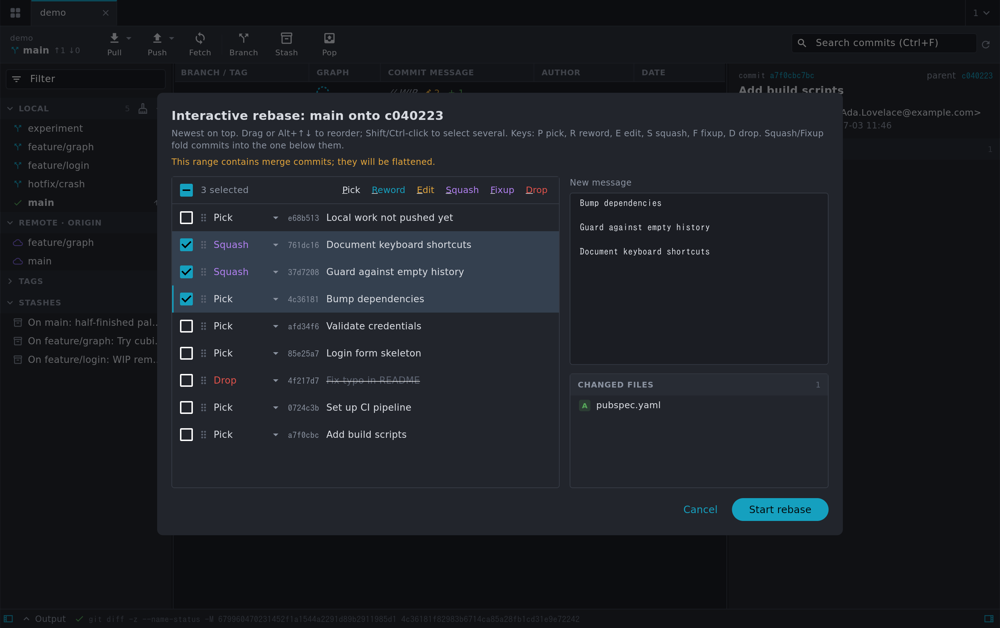
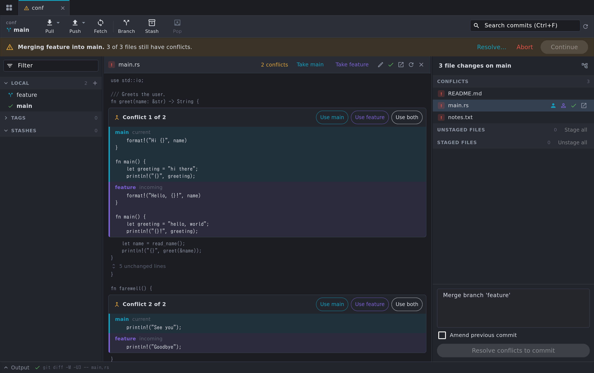

# Gutter

A fast git client for macOS, Linux and Windows, inspired by GitKraken. Built with
Flutter on top of your system `git`.

> **Disclaimer:** This app was heavily vibe coded with Claude Opus 5.5. Mostly out of spite of GitKraken becoming ever so bloated and unstable.



## Install

Gutter needs `git` installed.

- **Linux, Flatpak**: install it from Gutter's Flatpak repository:

  ```sh
  flatpak install --user https://serjlee.github.io/gutter/gutter.flatpakref
  ```

Or download the latest build from the
[Releases](https://github.com/serjlee/gutter/releases) page:

- **macOS** (`Gutter-macos-<version>.zip`, Apple Silicon and Intel): move
  `Gutter.app` to `/Applications`, then clear the quarantine flag (the app
  isn't notarized):
  `xattr -dr com.apple.quarantine /Applications/Gutter.app`
- **Linux, tarball**: extract `gutter-linux-x64-<version>.tar.gz` and run
  `./gutter` (needs GTK 3).
- **Windows** (x64): run `Gutter-windows-x64-<version>-setup.exe`, or
  extract `Gutter-windows-x64-<version>.zip` anywhere and run `gutter.exe`.
  Neither is signed: on SmartScreen's warning, click **More info → Run
  anyway**.

From then on the macOS app, the tarball and both Windows builds update
themselves: Gutter offers
each new release, downloads it, checks it against the release's checksums
and swaps it in when you restart or quit. The Flatpak updates from its
repository: Gutter runs `flatpak update` for you, and your software center
or `flatpak update` work too.

<details>
<summary>More on installing</summary>

**macOS.** Gutter is ad-hoc signed, not notarized (there's no paid Apple
Developer account behind it), so macOS blocks it until the quarantine flag
is cleared. Only the first install needs it: updates Gutter downloads
itself aren't quarantined. Besides the `xattr` command:

- `tool/install_macos.sh` downloads the latest release (needs `gh`),
  installs it and clears the flag. It also takes a downloaded zip:
  `tool/install_macos.sh ~/Downloads/Gutter-macos-0.1.0.zip`.
- Or open Gutter once, then System Settings → Privacy & Security →
  **Open Anyway**. On macOS 15 and later, right-click → Open no longer
  bypasses the block.

Install git with `xcode-select --install` or Homebrew. The first time you
scan a folder under Documents or Desktop, macOS asks for access. The app
isn't sandboxed (`macos/Runner/*.entitlements`): it runs `git` and reads
repositories anywhere on disk.

**Flatpak.** Gutter runs your system's git through `flatpak-spawn --host`,
so your config, credential helpers, signing keys and hooks work as in a
terminal, and it can read files anywhere (`--filesystem=host`).

**Windows.** The installer installs for your user only
(`%LOCALAPPDATA%\Programs\Gutter`), so neither it nor updates ask for admin
rights. Windows doesn't come with git: if Gutter can't find it, the home tab
offers to install Git for Windows with `winget` (or get it from
[git-scm.com](https://git-scm.com/downloads)). Its Git Credential Manager
signs you in to GitHub and others; for SSH remotes, start the "OpenSSH
Authentication Agent" service and `ssh-add` your key.

**Which git.** Gutter looks on `PATH`, then in `/opt/homebrew/bin`,
`/usr/local/bin` and `/usr/bin` (Homebrew's first on macOS: apps opened
from Finder don't get your shell's `PATH`, and `/usr/bin/git` needs
Apple's command line tools); on Windows, in Git for Windows' install
folders. You can pick another on the home tab.

</details>

## Features

- **Commit graph**: lane-colored branches, merged local/remote ref labels,
  tags, with support for stashes, search, avatars, and more.
- **Tabs**, tabbed repositories with grouping support and search.
- **Repository discovery**: every repository under a folder is found in
  the background. Open, clone or init from the home tab.
- **Diffs**: unified, split or full file (images too), with optional
  syntax highlighting.
- **Interactive rebase** without a text editor, with keyboard shortcuts
  and actions on several commits at once.
- **Conflicts** resolved in the app: current, incoming or both for each
  conflict, or a whole side per file, for merges, rebases, cherry-picks
  and stashes.
- **Errors explained**, with the full output one click away in each tab's
  **Output** panel, which logs every git command it ran.
- **Light and dark themes**, following the system's by default.
- **UI zoom** for high-DPI screens.

<details>
<summary>Screenshots</summary>








</details>

<details>
<summary>Keyboard shortcuts</summary>

| Keys | Action |
| --- | --- |
| `Ctrl/Cmd T` | Repositories (home) tab |
| `Ctrl/Cmd O` | Open repository |
| `Ctrl/Cmd W` | Close tab |
| `Ctrl Tab` / `Ctrl Shift Tab` | Next / previous tab |
| `Ctrl/Cmd 1…9` | Go to tab |
| `Ctrl/Cmd Shift A` | All tabs (search) |
| `Ctrl/Cmd R`, `F5` | Refresh |
| `Ctrl/Cmd F` | Search commits (`Enter` / `Shift Enter` to step) |
| `↑ ↓ PgUp PgDn Home End` | Move through the graph |
| `Ctrl/Cmd Enter` | Commit (in the message box) |
| `Esc`, mouse back button | Close the diff, then the details panel |
| `Ctrl/Cmd I` | Show / hide the details panel |
| `Ctrl/Cmd B` | Show / hide the sidebar |
| `P R E S F D` | Interactive rebase: pick / reword / edit / squash / fixup / drop the selected commits |
| `Alt ↑ ↓` | Interactive rebase: move the selected commits |
| `Ctrl/Cmd + / - / 0` | Zoom in / out / reset (or `Ctrl/Cmd` + mouse wheel) |

</details>

<details>
<summary>Performance</summary>

git's output is parsed off the UI thread, the graph is laid out in an
isolate in compact typed arrays, and only visible rows are painted: the
85k commits of git.git take about 1.5 MB and lay out in about 130 ms. A
large repository without a commit-graph file gets one, which makes
loading history several times faster.

</details>

## Network and privacy

Besides your own fetch, pull and push, Gutter makes two kinds of requests:

- **Update check**: every 6 hours it asks GitHub for the latest release of
  Gutter, and offers it when there's a newer one. It downloads the release
  (from GitHub) only when you choose to update.
- **GitHub avatars** (repositories on GitHub only): each author's picture
  is requested from GitHub's avatar server by commit email, as rows come
  into view.

Fetch, pull and push use your git setup (SSH agent, credential helper).
Gutter never shows a password prompt.

## Development

You need Flutter (stable) and git; on Linux also
`clang cmake ninja-build pkg-config libgtk-3-dev`; on Windows, Visual
Studio with "Desktop development with C++".

```sh
flutter run -d macos          # or: -d linux, -d windows
flutter analyze && flutter test
```

<details>
<summary>More commands and layout</summary>

```sh
xvfb-run flutter drive --profile -d linux \
  --driver test_driver/integration_test.dart \
  --target integration_test/app_test.dart         # real app, AOT-compiled
dart run tool/bench_layout.dart 200000            # graph layout benchmark
dart run tool/bench_repo.dart /path/to/big/repo   # history load timings
tool/make_demo_repo.sh /tmp/demo                  # branchy demo repository
tool/make_icons.sh                                # icons from assets/icon/source.png
```

```
lib/git/     git runner, parsers, Repository API, partial patches, rebase plans
lib/graph/   lane layout + row painter
lib/scan/    repository discovery
lib/app/     app state, settings, theme, zoom, avatars
lib/ui/      shell, tabs, graph view, sidebar, details, diff, dialogs
```

- **Version label**: for a local build, pass
  `--dart-define=GUTTER_VERSION=0.1.0 --dart-define=GUTTER_COMMIT=$(git rev-parse --short HEAD)`.
- **Flatpak locally**: see `linux/flatpak/dev.gutter.gutter.yml`.
- **Windows installer locally**: after `flutter build windows`, run
  `iscc /DAppVersion=0.1.0 windows\installer\gutter.iss` (Inno Setup 6).

</details>

## License

GPL-3.0-or-later. Copyright (C) 2026 the Gutter contributors. See
[LICENSE](LICENSE).
